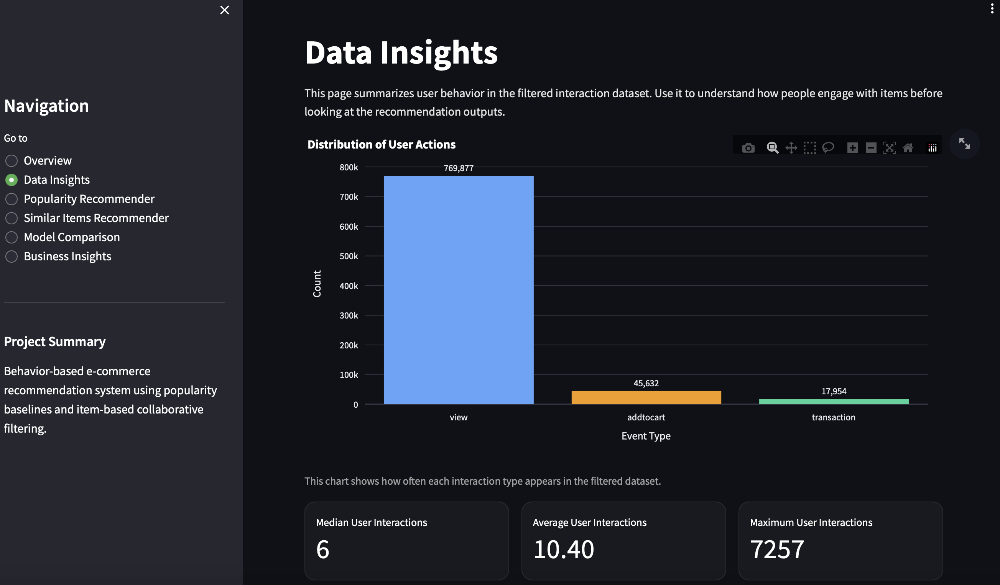
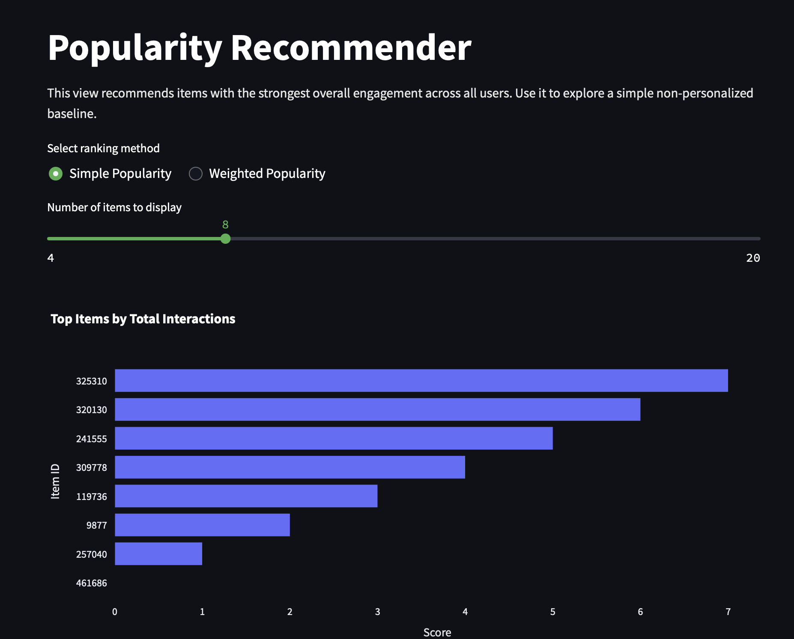

# Ecommerce Recommender System
An end-to-end ML recommendation system using real-world e-commerce interaction data, packaged in a interactive Streamlit dashboard.

# View the App

View the interactive app by clicking the link below. If app has not been accessed recently may require up to 30 seconds to load or pressing of reactivation button.

[View App Here](https://ecommerce-recommender-system-fcffnpilbvxhfzpdaud5ft.streamlit.app/)

App preview:

## Project Overview

This project builds an end-to-end recommendation system using real-world e-commerce interaction data (RetailRocket e-commerce dataset). It pushes beyond looking purely at most popular items and towards more targeted recommendations, using user behavior (views, add to carts, purchases) to identify product relationships and whether more advanced methods of curating recommendations improves recommendation results. 

## Dataset

This project uses the RetailRocket e-commerce dataset. The dataset can be accessed by clicking the link below.

[Access Dataset Here](https://www.kaggle.com/datasets/retailrocket/ecommerce-dataset)

The dataset contains anonymous user interaction events (product views, add-to-cart actions, transactions), and includes item-level metadata (category hierarchy, item properties) as well.

Data preprocessing included:

- Filtering
  - Removal of irrelevant or sparse interactions from dataset
  - Focus on meaningful user-item interactions
- Aggregation
  - Aggregation of interactions at the user-item level
  - Transformation of raw logs into structured features for modeling
- Feature Engineering
  - Differentiation of user intent by assigning weights to interactions (views < add-to-cart < purchases) 

# Methods

## Popularity-Based Recommender

The baseline popularity recommender ranked items by overall interaction frequency, and served as a simplistic yet effective model for recommending trending items without personalization. 

## Weighted Popularity

The weighted popularity recommender built off of the baseline model and assigned different weights to views, carts, and purchases, better reflecting true user intent and engagement.

## Item-Based Collaborative Filtering

This system built item-to-item similarity using co-occurrence of user interactions and captured relationships between products based on shared user behavior, enabling more targeted and context-aware recommendations. For example, if many users viewed or purchased both item A and item B, the model learns that these items are related and can recommend A when B is selected or vice versa.

# Evaluation

Models were evaluated using Hit Rate at 10. Recommendation scenarios were simulated using historical interaction data, and comparisons were made between the baseline versus collaborative filtering systems on performance. The focus was on practical recommendation quality rather than exclusively model complexity.

# Results

The evaluation of the two recommendation systems showed that the collaborative filtering model significantly out-performed the baseline model, achieving approximately 4.3x improvement in Hit Rate at 10. This boost in performance from baseline demonstrated the value of behavior-driven recommendation strategies rather than relying on interaction frequency alone, and that even relatively simple collaborative approaches can meaningfully outperform baseline approaches.

# App Features

To view the app, click the link below. If the app has not been accessed recently may require up to 30 seconds to load or pressing of reactivation button.

[View App Here](https://ecommerce-recommender-system-fcffnpilbvxhfzpdaud5ft.streamlit.app/)

The features of the app are as follows:

- Overview Page
  - A high-level project summary and display of key metrics
- Data Insights
  - Visualizations of interaction distributions, top popular items, and category patterns
- Popularity Recommender
  - Display of most frequently interacted with items with an ability to switch between baseline and weighted popularity, featured results cards, and an expandable recommendation table
- Similar Items Recommender
  - Returns related products based on item similarity and allows users to toggle between different items to observe associated data
  - Category distribution of popular items
  - Feature cards
  - Expandable recommendation table
- Business Insights
  - Summary of model performance and key takeaways
   

# Key Insights

Key insights include:

- Popularity-based recommendations are relatively effective but not personalized and therefore weaker than systems that consider item relationships demonstrated by user behavior
- Behavioral similarity reveals unique relationships between items that are not discernible based on observing frequency alone
- Recommendation quality significantly improves when incorporating interaction patterns
- Metadata improves interpretability of datasets but is not a strict requirement for modeling

 # Repository Structure

 - recommendation_app.py: Streamlit dashboard
 - RetailRocket/: processed datasets used for modeling and app
 - Notebooks/: data preparation, modeling, and evaluation workflows
 - Images: contains screenshots of app
 - requirements.txt: project dependencies

# How to Run

- Clone repository
- Install dependencies
- Run Streamlit app

# Future Improvements

Future project improvements include: 

- Building hybrid models that incorporate both collaboration and metadata
- User-level personalization
- Real-time recommendation updates
- More robust product metadata (names, descriptions, embeddings)
- A/B testing in a production environment
    
